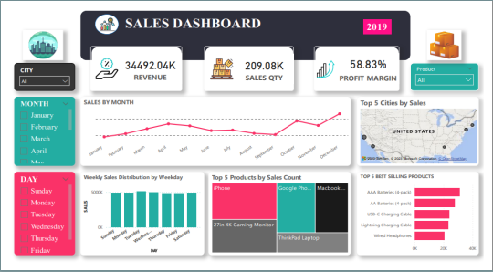

# Sales-Data-Analysis

In this project, I utilised power BI and dived into a large sales dataset exploring sales trends over time, identifying the best-selling products, calculated revenue metrics such as total sales and profit margins, and create visualizations to present findings effectively.
